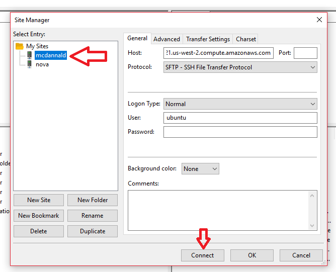

Setting up FileZilla connection
===============================

 * Open FileZilla (or any other FTP client)
 * Open the site manager 
 * Select the "New site" button and give it a name 
 * In the host input field, enter "ec2-35-165-254-221.us-west-2.compute.amazonaws.com" 
 * Select the "SFTP" option from the Protocol dropdown 
 * Select login type "Normal" from the dropdown 
 * Enter "ubuntu" into the "User" input field 
 * You can now connect by clicking the connect button 

Updating files on server
========================

 * Open FileZilla (or any other FTP client)
 * Open the site manager 
 * Select the mcdannald site and click connect 
 * Copy individual files into the test or production folders, or drag and drop the whole folder over to update all files

Adding new person
=================

 * Open scripts/people.js
 * Copy one of the existing person elements (pay close attention to the commas between them)
 * Edit the values to whatever is desired
 * Copy over the new scripts/people.js file over to the test platform
 * Check the formatting of the file by going to http://mcdannaldlab.org:8080/checkFormatting
 * If it shows that scripts/people.js was successful, copy the file over to the production platform

Adding new publication
======================

 * Open scripts/publications.js
 * Copy one of the existing publication elements (pay close attention to the commas between them)
 * Edit the values to whatever is desired
 * Copy over the new scripts/publications.js file over to the test platform
 * Check the formatting of the file by going to http://mcdannaldlab.org:8080/checkFormatting
 * If it shows that scripts/publications.js was successful, copy the file over to the production platform
 
Creating a new page
===================

 * Open the scripts/pages.js script
 * Copy one of the existing page elements (pay close attention to the commas between them)
 * Remove the css property
 * Update the url property to reflect where you want the page to be. Make sure there is no extension to the url (no .html)
 * The result should look something like:
	<pre>
		{
			url: "resources/something"
		}
    </pre>
 * Now, in your file explorer, create a new file at the file location that the url points to. In this case, the file structure would look like:
    <pre>
		root project folder ("test" or "production")
		|----> content
			 |----> ...
		|----> instructions
			 |----> ...
		|----> resources
			 |----> analysis.html
			 |----> ardbark.html
			 |----> behavior.html
			 |----> optogenetics.html
			 |----> *something.html* <----- create it here - make sure it has .html extension here
		|----> scripts
			 |----> ...
		|----> WEB-INF
			 |----> ...
		|----> checkFormatting.html
		|----> contact.html
		|----> home.html
    </pre>
  
  * Now you can edit the file contents to have any html you want to show. It might be easier to copy the contents of an already created page and go from there.
  * Once finished, copy over the file to the desired directory on the test and production platform
  
Adding a page to the main menu bar
==================================

 * Open index.html
 * Find the `<ul>` element in the code that looks like:
     ```
         <ul>
         
			<li ng-class="{ selected: state.name == 'home' }"><a ui-sref="home">Home</a></li>
			
			<li ng-class="{ selected: state.name == 'people' }"><a ui-sref="people">People</a></li>
			
			<li ng-class="{ selected: state.name == 'publications' }"><a ui-sref="publications">Publications</a></li>
			
			<li ng-class="{ selected: state.name == 'resources' }"><a ui-sref="resources">Resources</a></li>
			
			<li ng-class="{ selected: state.name == 'contact' }"><a ui-sref="contact">Contact</a></li>
			
		</ul>
    ```
 * Copy one of the existing `<li>` tags and edit the values to reflect the new page's name. If the page is not on the root level of the project, you will need to specify the full path to the page in the "state.name == 'path/to/page'" part, as well as the 'ui-sref="path/to/page"' part.
 * Make sure to copy over the index.html to the test and production platforms. You will need to overwrite the old one.