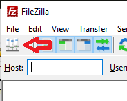

Updating files on server
========================
 * Open Filezilla (or any other FTP client)
 * Open the site manager 
 * Select the mcdannald site and click connect 
 * 

Adding new person
=================

 * Open scripts/people.js
 * Copy one of the existing person elements (pay close attention to the commas between them)
 * Edit the values to whatever is desired
 * Copy over the new scripts/people.js file over to the test platform
 * Check the formatting of the file by going to http://mcdannaldlab.org:8080/checkFormatting
 * If it shows that scripts/people.js was successful, copy the file over to the production platform